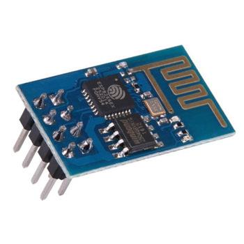

<h2 align="center">BAB II    LANDASAN TEORI </h2>
<strong>2.1 Definisi Sampah</strong>

Menurut[1] Undang-Undang Repuplik Indinesia Nomor 18 Tahun 2008 Tentang Pengelolaan Sampah pada Bab 1 Pasal 1 sampah adalah sisa kegiatan sehari-hari manusia dan/atau proses alam yang berbentuk padat. Jenis sampah dapat dikategorikan dalam 3 kategori, yaitu :
 
1. Sampah rumah tangga yang berasal dari kegiatan sehari-hari dalam rumah tangga
 
2. Sampah sejenis rumah tangga berasal dari kawasan komersial, kawasan industri, kawasan khusus, fasilitas sosial, fasilitas umum, dan/atau fasilitas lainnya.
 
3. Sampah spesifik meliputi : 
 
&nbsp;&nbsp;&nbsp;&nbsp;&nbsp;a. sampah yang mengandung bahan berbahaya dan beracun
 
&nbsp;&nbsp;&nbsp;&nbsp;&nbsp;b. sampah yang mengandung limbah bahan berbahaya dan beracun
 
&nbsp;&nbsp;&nbsp;&nbsp;&nbsp;c. sampah yang timbul akibat bencana
 
&nbsp;&nbsp;&nbsp;&nbsp;&nbsp;d. puing bongkaran 
 
&nbsp;&nbsp;&nbsp;&nbsp;&nbsp;e. sampah yang secara teknologi belum dapat diolah; dan/atau 
 
&nbsp;&nbsp;&nbsp;&nbsp;&nbsp;f. sampah yang timbul secara tidak periodik.

 
<strong>2.2 Definisi IoT ( Internet of Things )</strong>

Menurut  Burange & Misalkar [2] “Internet of Things (IOT) adalah struktur di mana objek, orang disediakan dengan identitas eksklusif dan kemampuan untuk pindah data melalui jaringan tanpa memerlukan dua arah antara manusia ke manusia yaitu sumber ke tujuan atau interaksi manusia ke computer”. Menurut Keoh, Kumar, & Tschofenig [3] “Internet of Things merupakan perkembangan keilmuan yang sangat menjanjikan untuk mengoptimalkan kehidupan berdasarkan sensor cerdas dan peralatan pintar yang bekerjasama melalui jaringan internet”.

 
<strong>2.3 Arduino Uno</strong>

    
     
    Gambar 2.1 Arduino Mega 2560

Arduino adalah nama keluarga papan mikrokontroller yang awalnya dibuat oleh perusahaan Smart Projects. Salah satu tokoh penciptanya adalah Massimo Banzi. Papan ini merupakan perangkat keras yang bersifat open source sehingga boleh dibuat oleh siapa saja. Arduino Uno adalah papan berukuran sebesar kartu kredit. Walaupun berukuran kecil, papan tersebut mengandung mikrokontroler dan sejumlah input/output (I/O) yang memudahkan pemakai untuk menciptakan berbagai proyek elektronika yang dikhususkan untuk menangani tujuan tertentu. Arduino Uno dilengkapi dengan static <i>random-access memory</i> (SRAM) berukuran 2kb untuk memegang data, flash memory berukuran 32kb, dan erasable programmable <i>read-only memory</i> (EEPROM). SRAM digunakan untuk menampung data atau hasil pemrosesan data selama arduino selama arduino menerima pasokan catu daya. Flash Memory untuk menaruh program yang dibuat. EEPROM digunakan untuk menaruh program bawaan dari Arduino Uno dan sebagian lagi dapat dimanfaatkan untuk menaruh data program yang dibuat oleh kita secara permanen [4].

 
<strong>2.4 ESP8266</strong>

    
     
    Gambar 2.2 ESP8266

ESP8266 adalah sebuah modul WiFi yang akhir-akhir ini semakin digemari para hardware developer. Selain karena harganya yang sangat terjangkau, modul WiFi serbaguna ini sudah bersifat SOC <i>(System on Chip)</i>, sehingga kita bisa melakukan programming langsung ke ESP8266 tanpa memerlukan mikrokontroller tambahan [5].

 
<strong>2.5 Sensor Ultasonik</strong>

    
     
    Gambar 2.3 Sensor Ultrasonic

Sensor ultrasonik merupakan sensor yang bekerja dengan cara memancarkan suatu gelombang dan kemudian menghitung waktu pantulan gelombang tersebut. Kelebihan sensor ini ialah hanya membutuhkan 1 sinyal (SIG), selain jalur 5V dan ground. Sensor ultrasonik mendeteksi jarak obyek dengan cara memancarkan gelombang ultrasonik (40 KHz) kemudian mendeteksi pantulannya. Sensor PING memancarkan gelombang ultrasonik sesuai dengan kontrol dari mikrokontroler pengendali [6].

 
<strong>2.6 Bread Board</strong>

    
     
    Gambar 2.4 Bread Board

Breadboard adalah papan yang digunakan untuk menempatkan dan menyusun piranti / komponen-komponen elektronika menjadi rangkaian elektronika tanpa penyolderan. Hubungan antar piranti/komponen yang satu dengan piranti/komponen elektronika yang lain pada breadboard dilakukan melalui kawat/kabel [7].

 
<strong>2.7 Liquid Crystal Display</strong>

    
     
    Gambar 2.5 Liquid Crystal Display

LCD (Liquid Crystal Display) adalah suatu jenis media tampilan yang menggunakan kristal cair sebagai penampil utama. LCD sudah digunakan di berbagai bidang, misalnya dalam alat-alat elektronik, seperti televisi, kalkulator ataupun layar komputer [8].

 
<strong>2.8 Motor Servo</strong>

    
     
    Gambar 2.6 Motor Servo

Motor servo adalah jenis motor yang memiliki 3 kabel. Masing-masing digunakan sebagai catu daya, ground, dan control. Kabel control digunakan untuk menentukan motor untuk memutar rotor ke arah posisi tertentu. Biasanya rotor hanya berputar hingga 200 derajat. Namun ada pula yang mampu berputar sebesar 360 derajat [9].

